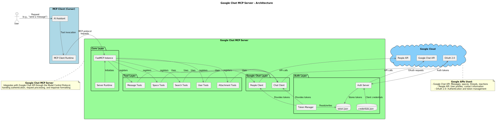
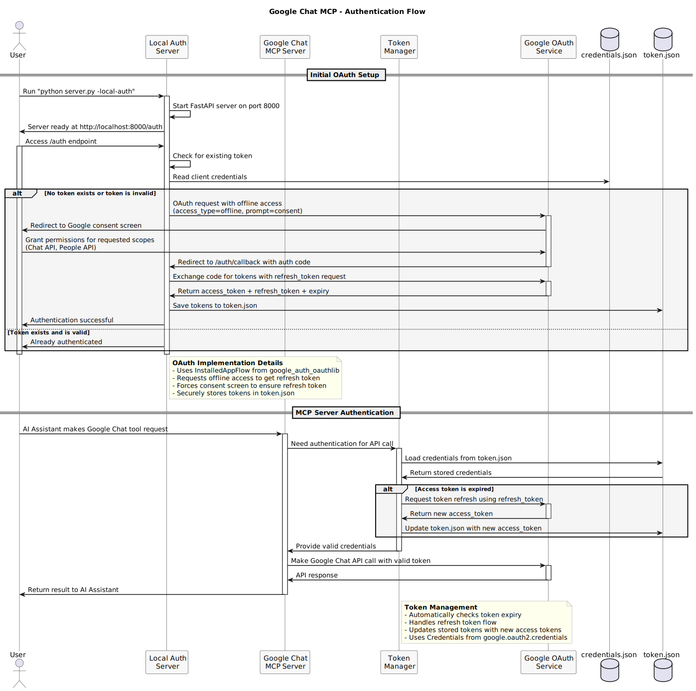
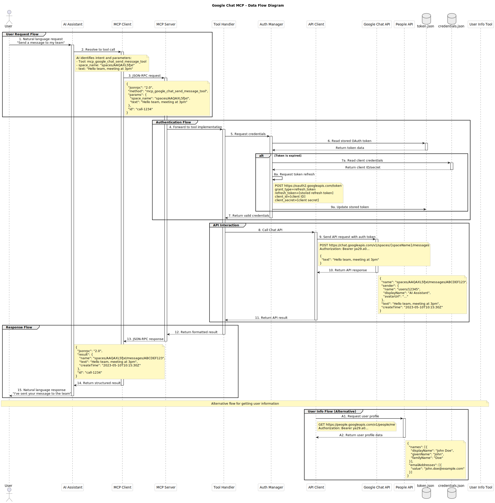
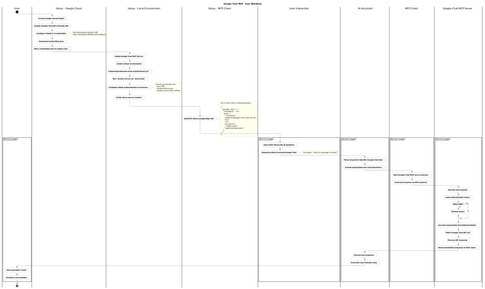
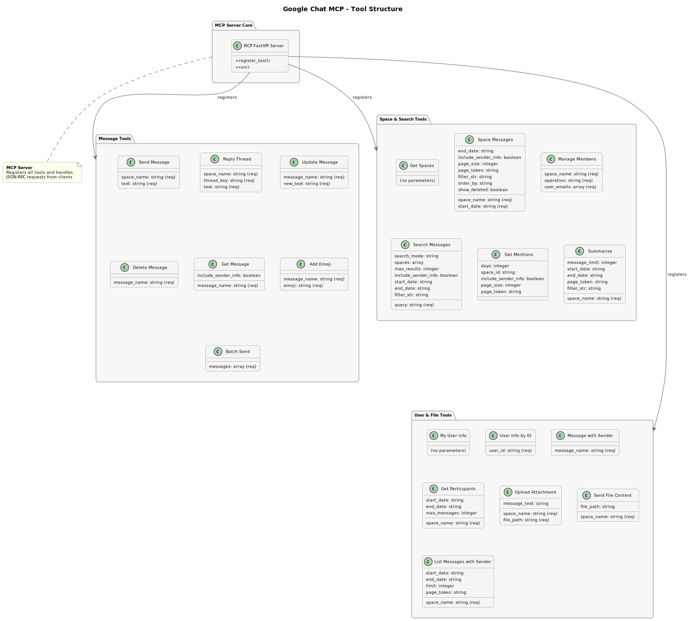

# Google Chat MCP Server

## Project Overview

This project provides a server implementation for the Model Control Protocol (MCP) that integrates with the Google Chat API, allowing AI assistants to interact with Google Chat. Once configured, the MCP client (e.g., Cursor) will manage the server lifecycle automatically when needed.

The Google Chat MCP Server enables AI assistants to perform rich, interactive operations with Google Chat, including sending messages, searching conversations, managing spaces, and accessing user information. It handles all OAuth authentication, token management, and API interactions to provide a seamless experience.

Key benefits of this implementation:
- **Seamless Integration**: Works directly with Cursor and other MCP-compatible AI assistants
- **Comprehensive API Coverage**: Supports most Google Chat API operations
- **Enterprise Ready**: Designed for use in Google Workspace environments
- **Advanced Search**: Includes regex, exact, and semantic search capabilities
- **Enhanced User Information**: Provides detailed sender information with messages

## Features

- Authentication with Google Chat API using OAuth 2.0
- Sending and reading messages across spaces and direct messages
- Pagination support for large result sets
- Enhanced sender information with complete user profiles
- Managing spaces and members
- Adding emoji reactions to messages
- Searching messages using text queries
- Sending file contents as messages
- Finding mentions of your username in messages
- Getting user profile information
- Working with message threads and replies
- Batch sending of multiple messages
- Conversation summarization and participant analysis

## Setup

### Prerequisites

- **Google Workspace Account**: This tool only works with Google Workspace accounts (formerly G Suite) in an organization. Personal Google accounts cannot access the Google Chat API.
- **Google Cloud Platform Project**: You must be able to create and configure a project in Google Cloud Console.
- **OAuth 2.0 Understanding**: Basic familiarity with OAuth authentication flows is helpful.
- **Python 3.9+**: The server requires Python 3.9 or newer.
- **UV Package Manager**: This project uses UV for dependency management.

### 1. Installation

1. Clone this repository:

```bash
git clone https://github.com/twlabs/AIFSD-google-chat-mcp.git
cd AIFSD-google-chat-mcp
```

2. Install UV if you don't have it already:

```bash
# Install UV using pip
pip install uv

# Or on macOS using Homebrew
brew install uv
```

3. Create a virtual environment and install requirements using UV (recommended):

```bash
# Create virtual environment and install requirements in one step
uv venv .venv

# Activate the environment
source .venv/bin/activate  # On Windows: .venv\Scripts\activate

# Install requirements
uv pip install -r requirements.txt
```

4. Alternatively, you can use traditional pip:

```bash
python -m venv .venv
source .venv/bin/activate  # On Windows: .venv\Scripts\activate
pip install -r requirements.txt
```

### 2. Authentication Setup

1. **Create a Google Cloud Platform project**:
   - Go to the [Google Cloud Console](https://console.cloud.google.com/)
   - Create a new project or select an existing one
   - Enable the Google Chat API for your project:
     - Navigate to "APIs & Services" > "Library"
     - Search for "Google Chat API" and enable it
   - Additionally, enable the People API if you plan to use the `get_my_mentions` tool or access user information:
     - Navigate to "APIs & Services" > "Library"
     - Search for "People API" and enable it

   > **Important**: This tool can only be used with Google Workspace accounts in an organization. Personal Google accounts cannot create Google Chat API projects. You must have a Google Workspace account to set up OAuth credentials and use this tool.

2. **Set up OAuth credentials**:
   - Go to "APIs & Services" > "Credentials"
   - Click "Create Credentials" > "OAuth client ID"
   - Select "Web application" as the application type (not Desktop app)
   - Give it a name (e.g., "Google Chat MCP Client")
   - Under "Authorized JavaScript origins" add: `http://localhost:8000`
   - Under "Authorized redirect URIs" add: `http://localhost:8000/auth/callback`
   - Click "Create" and download the JSON file
   - **Important**: Rename the downloaded file to `credentials.json` and place it in one of these locations:
     - Root directory of the project
     - `src/providers/google_chat/` directory
     - Any other location as long as you update the `CREDENTIALS_FILE` path in `constants.py`
   - This credentials.json file contains the client configuration that Google uses to verify your application's identity during the OAuth flow. Without it, authentication will fail.
   - Reference: [Google OAuth 2.0 Documentation](https://developers.google.com/identity/protocols/oauth2)

3. **Authenticate with Google**:
   - Run the authentication server:
     ```bash
     python -m src.server -local-auth
     ```
   - Visit http://localhost:8000/auth in your browser
   - Follow the OAuth flow to grant permissions
   - After successful authentication, a `token.json` file will be generated in the default path (src/providers/google_chat/token.json)
   - This token will be used for all future API requests, and the MCP server will automatically refresh it when needed

   > **Custom Token Path**: If you want to store the token in a custom location, use the `--token-path` parameter:
   > ```bash
   > python -m src.server -local-auth --token-path "/custom/path/to/token.json"
   > ```
   > Remember to use this exact same path in your MCP client configuration!
   >
   > The token path in your `mcp.json` file must always match where the token was actually generated during authentication.

### 3. Configure Your MCP Client

Add the Google Chat MCP server to your MCP client's configuration. For Cursor, edit your `~/.cursor/mcp.json` file:

```json
{
  "google_chat": {
    "command": "uv",
    "args": [
      "--directory",
      "/path/to/google-chat-mcp-server-main",
      "run",
      "-m",
      "src.server",
      "--token-path",
      "/path/to/google-chat-mcp-server-main/src/providers/google_chat/token.json"
    ]
  }
}
```

Replace `/path/to/google-chat-mcp-server-main` with the absolute path to your repository.

> **IMPORTANT**: You must ensure that the `--token-path` value in your MCP configuration matches exactly the path where your token will be stored during authentication. If these paths don't match, the server won't be able to find your authentication token.

**Important File Locations and Path Consistency:**
- `credentials.json`: Can be placed anywhere on your system, with common locations being:
  - The root directory of the project (traditional location)
  - The `src/providers/google_chat/` directory
  - Any custom location specified in `CREDENTIALS_FILE` in `constants.py`
- `token.json`: Location is determined by the `--token-path` parameter during authentication (default is `src/providers/google_chat/token.json`)
- `search_config.yaml`: Can be placed anywhere on your system, with common locations being:
  - The root directory of the project (traditional location)
  - The `src/providers/google_chat/utils/` directory
  - Any custom location specified in `SEARCH_CONFIG_YAML_PATH` in `constants.py`

**Path Configuration:**
1. When you run the authentication server with `python -m src.server -local-auth`, it will store the token at the path specified by `--token-path` (or the default location if not specified)
2. Your `mcp.json` configuration must use the **exact same token path** for the server to find your authentication token
3. You have flexibility in where you store the files, but you must ensure the paths in `constants.py` and your MCP configuration remain consistent

For example, if you authenticate with:
```bash
python -m src.server -local-auth --token-path "/custom/path/to/token.json"
```

Then your `mcp.json` must specify:
```json
"--token-path", "/custom/path/to/token.json"
```

**Directory Structure:**
```
google-chat-mcp-server-main/
├── diagrams/                # SVG diagrams and source files
├── docs/                    # Documentation files
├── src/
│   ├── providers/
│   │   └── google_chat/     # Google Chat provider implementation
│   │       ├── api/         # API client implementations
│   │       ├── tools/       # MCP tool implementations
│   │       ├── utils/       # Utility functions and helpers
│   │       │   ├── constants.py       # Contains configurable file paths
│   │       │   └── search_config.yaml # Search configuration (can be here)
│   │       ├── credentials.json # OAuth client configuration (can be here)
│   │       └── token.json   # Default OAuth token storage location
│   ├── __init__.py
│   ├── mcp_instance.py      # MCP instance configuration
│   └── server.py            # Main server implementation
```

**Updating File Paths**:

The file paths for credentials, token, and configuration files are defined in the constants file and can be modified to point to any location on your system:

```python
# File: src/providers/google_chat/utils/constants.py

# Update these paths to match where you've placed your files
DEFAULT_TOKEN_PATH = "/absolute/path/to/token.json"
CREDENTIALS_FILE = "/absolute/path/to/credentials.json"
SEARCH_CONFIG_YAML_PATH = "/absolute/path/to/search_config.yaml"
```

> **Important**: When updating these paths, always use absolute paths to avoid any resolution issues. Relative paths may not work correctly depending on how the server is started.
>

> **Note**: After completing this setup, you can close this project. The MCP client (e.g., Cursor) will automatically start and manage the server process when you use Google Chat MCP tools in your AI assistant.

## Architecture Diagrams

The following diagrams provide a visual representation of the Google Chat MCP server's architecture and workflows:

### System Architecture

*High-level architecture diagram showing the main components of the Google Chat MCP system and their interactions.*

### Authentication Flow

*Detailed authentication flow showing the OAuth 2.0 process used to authenticate with Google Chat API.*

### Data Flow

*Complete data flow sequence from user request through the MCP client, server, authentication, and API interactions.*

### User Workflow

*End-to-end user workflow covering setup, configuration, and usage patterns for the Google Chat MCP.*

### Tools Structure

*Structured overview of all available tools and their parameters for interacting with Google Chat.*

## Testing

### Running Tests

The project includes a comprehensive test suite. To run the tests:

```bash
# Activate your virtual environment if not already active
source .venv/bin/activate  # On Windows: .venv\Scripts\activate

# Run all tests with coverage report
python -m pytest


# Run tests with detailed coverage information
python -m pytest src/providers/google_chat/tools/tests/ --cov=src.tools --cov-report=term-missing -v
```

### Test Structure

The test structure is organized as follows:

```
src/
  providers/
    google_chat/
      api/tests/       - Tests for API client functionality
      tools/tests/     - Tests for MCP tools
      utils/tests/     - Tests for utility functions
```

Tests can be run directly using `pytest`:

```bash
# Run all tests
python -m pytest

# Run tests with verbose output
python -m pytest -v

# Run a specific test module
python -m pytest src/providers/google_chat/api/tests/test_auth.py

# Run tests with coverage report
python -m pytest --cov=src

# Run tests with detailed coverage information
python -m pytest src/providers/google_chat/tools/tests/ --cov=src.tools --cov-report=term-missing -v
```

See `docs/TEST_IMPROVEMENTS.md` for detailed information about test coverage and future improvements.

## Available Tools

The following tools are available to interact with Google Chat:


### Chat Space Management
- **`mcp_google_chat_get_chat_spaces_tool`** - List all Google Chat spaces you have access to
  - Parameters: none
  - Returns: Array of space objects with details like name, type, display name

- **`mcp_google_chat_get_space_messages_tool`** - List messages from a specific space with date filtering
  - Parameters: 
    - `space_name` (string, required): Space identifier (e.g., "spaces/AAQAtjsc9v4")
    - `start_date` (string, required): Date in YYYY-MM-DD format
    - `end_date` (string, optional): Date in YYYY-MM-DD format
    - `include_sender_info` (boolean, optional): Whether to include detailed sender information
    - `page_size` (integer, optional): Maximum number of messages to return (default: 25, max: 1000)
    - `page_token` (string, optional): Token for retrieving the next page of results
    - `filter_str` (string, optional): Custom filter string in Google Chat API format
    - `order_by` (string, optional): Ordering format like "createTime DESC"
    - `show_deleted` (boolean, optional): Whether to include deleted messages
  - Returns: Dictionary containing an array of message objects and a nextPageToken for pagination

### Messaging
- **`mcp_google_chat_send_message_tool`** - Send a text message to a Google Chat space
  - Parameters: 
    - `space_name` (string, required): Space identifier
    - `text` (string, required): Message content
  - Returns: Created message object

- **`mcp_google_chat_reply_to_message_thread_tool`** - Reply to an existing thread in a space
  - Parameters:
    - `space_name` (string, required): Space identifier
    - `thread_key` (string, required): Thread identifier
    - `text` (string, required): Reply content
  - Returns: Created message object

- **`mcp_google_chat_update_chat_message_tool`** - Update an existing message
  - Parameters:
    - `message_name` (string, required): Full resource name of message
    - `new_text` (string, required): Updated text content
  - Returns: Updated message object

- **`mcp_google_chat_delete_chat_message_tool`** - Delete a message
  - Parameters:
    - `message_name` (string, required): Full resource name of message
  - Returns: Empty response on success

### Message Interactions
- **`mcp_google_chat_add_emoji_reaction_tool`** - Add an emoji reaction to a message
  - Parameters:
    - `message_name` (string, required): Message identifier
    - `emoji` (string, required): Unicode emoji character
  - Returns: Created reaction object

- **`mcp_google_chat_get_chat_message_tool`** - Get details about a specific message
  - Parameters:
    - `message_name` (string, required): Message identifier
    - `include_sender_info` (boolean, optional): Whether to include detailed sender information
  - Returns: Full message object

### Search & Filtering
- **`mcp_google_chat_search_messages_tool`** - Search for messages across spaces
  - Parameters:
    - `query` (string, required): Search text
    - `search_mode` (string, optional): Search strategy to use ("regex", "semantic", "exact", or "hybrid")
    - `spaces` (array of strings, optional): List of spaces to search in
    - `max_results` (integer, optional): Maximum number of results (default: 50)
    - `include_sender_info` (boolean, optional): Whether to include detailed sender information
    - `start_date` (string, optional): Start date in YYYY-MM-DD format
    - `end_date` (string, optional): End date in YYYY-MM-DD format
    - `filter_str` (string, optional): Custom filter string in Google Chat API format
  - Returns: Dictionary with matching message objects and nextPageToken for pagination

- **`mcp_google_chat_get_my_mentions_tool`** - Find messages that mention you
  - Parameters:
    - `days` (integer, optional): Number of days to look back (default: 7)
    - `space_id` (string, optional): Limit search to a specific space
    - `include_sender_info` (boolean, optional): Whether to include detailed sender information (default: True)
    - `page_size` (integer, optional): Maximum number of messages to return (default: 50)
    - `page_token` (string, optional): Token for retrieving the next page of results
  - Returns: Dictionary with messages mentioning you and nextPageToken for pagination

#### Date Filtering in Search

The `search_messages_tool` supports powerful date filtering capabilities to narrow down your search results by message creation time. This is especially useful for finding messages within specific time frames or recent conversations.

Date filtering uses the YYYY-MM-DD format (e.g., "2024-05-01") and supports:

1. **Start date only** - Filter messages after a specific date:
   ```json
   {
     "query": "project status",
     "search_mode": "regex",
     "spaces": ["spaces/AAQAXL5fJxI"],
     "start_date": "2024-05-01"
   }
   ```
   This returns all messages created *after* May 1st, 2024.

2. **Date range** - Filter messages between two dates:
   ```json
   {
     "query": "meeting notes",
     "search_mode": "semantic",
     "spaces": ["spaces/AAQAXL5fJxI"],
     "start_date": "2024-05-01",
     "end_date": "2024-05-31"
   }
   ```
   This returns messages created after May 1st and before May 31st, 2024.

Important notes on date filtering:
- The Google Chat API uses `>` (greater than) for start dates and `<` (less than) for end dates, not `>=` or `<=`.
- For semantic searches, date filtering is treated as a preference rather than a strict requirement. If no messages match the date filter, the search will fall back to finding semantically relevant messages even outside the date range.
- For non-semantic searches (regex, exact), date filtering is strictly enforced.

### User Information
- **`mcp_google_chat_get_my_user_info_tool`** - Get your Google Chat user details
  - Parameters: none
  - Returns: User object with details like email, display name

- **`mcp_google_chat_get_user_info_by_id_tool`** - Get information about a specific user by their ID
  - Parameters:
    - `user_id` (string, required): The ID of the user to get information for
  - Returns: User object with details like email, display name, profile photo

- **`mcp_google_chat_get_message_with_sender_info_tool`** - Get a message with enhanced sender details
  - Parameters:
    - `message_name` (string, required): Full resource name of message
  - Returns: Full message object with additional sender_info field containing detailed user profile

- **`mcp_google_chat_list_messages_with_sender_info_tool`** - List messages with enhanced sender information
  - Parameters:
    - `space_name` (string, required): Space identifier
    - `start_date` (string, optional): Date in YYYY-MM-DD format
    - `end_date` (string, optional): Date in YYYY-MM-DD format
    - `limit` (integer, optional): Maximum number of messages (default: 10)
    - `page_token` (string, optional): Token for retrieving the next page of results
  - Returns: Dictionary with messages array and nextPageToken for pagination, with sender_info included

### Space Management
- **`mcp_google_chat_manage_space_members_tool`** - Add or remove members from a space
  - Parameters:
    - `space_name` (string, required): Space identifier
    - `operation` (string, required): Either "add" or "remove"
    - `user_emails` (array of strings, required): Email addresses to add/remove
  - Returns: Response with operation results

### File Handling
- **`mcp_google_chat_upload_attachment_tool`** - Upload a file as an attachment to a message
  - Parameters:
    - `space_name` (string, required): Space identifier
    - `file_path` (string, required): Path to the file to upload
    - `message_text` (string, optional): Additional text to include with the attachment
  - Returns: Created message object with attachment

- **`mcp_google_chat_send_file_message_tool`** - Send file contents as a message
  - Parameters:
    - `space_name` (string, required): Space identifier
    - `file_path` (string, required): Path to the file whose contents to send
    - `message_text` (string, optional): Additional text to include with the file content
  - Returns: Created message object

- **`mcp_google_chat_send_file_content_tool`** - Send file content as a formatted message
  - Parameters:
    - `space_name` (string, required): Space identifier
    - `file_path` (string, optional): Path to the file to send (defaults to sample file if not provided)
  - Returns: Created message object

### Batch Operations
- **`mcp_google_chat_batch_send_messages_tool`** - Send multiple messages in one operation
  - Parameters:
    - `messages` (array, required): List of message objects to send, each containing:
      - `space_name` (string, required): Space identifier
      - `text` (string, required): Message content
      - `thread_key` (string, optional): Thread to reply to
      - `cards_v2` (object, optional): Card content
  - Returns: Dictionary with results for each message

## Search Functionality Improvements

The search functionality in the Google Chat provider has been enhanced to provide better results across all topics:

1. **Enhanced Semantic Search**:
   - Lower base similarity threshold (0.30) for better recall
   - Dynamic thresholding based on result distribution
   - Special handling of edge cases
   - Implements both absolute and relative similarity scoring

2. **Smarter Hybrid Search**:
   - Combines regex, exact, and semantic search results
   - Multi-mode bonus for messages found by multiple methods
   - Weighted scoring system with configurable weights
   - Higher weight (1.8) for semantic matches

3. **Advanced Fallback Strategy**:
   - Multiple fallback levels when no results are found
   - Automatic relaxation of similarity thresholds
   - Fallback to partial word matching
   - Progressive search broadening

4. **Comprehensive Testing**:
   - Unit and integration tests for all search modes
   - Direct similarity measurement tools
   - Performance profiling for search operations

These improvements ensure better search results across all query types and domains. The search system now provides higher quality results by balancing precision and recall based on the search context.

For custom search requirements, you can adjust the configuration in `search_config.yaml`. This file can be placed in either:
- The root directory of the project
- `src/providers/google_chat/utils/` directory
- Any other location as long as you update the `SEARCH_CONFIG_YAML_PATH` in `constants.py`

## Cursor Rule for Effective MCP Use

To maximize the effectiveness of the Google Chat MCP integration with Cursor, consider adding the following rule to your Cursor custom instructions. This rule automates team communications and information retrieval through Google Chat:

```
Last Updated: May 22, 2025

If I say anything that even remotely, semantically or syntactically, implies communicating with my team—including, but not limited to, any of these phrases or their variants:

"Catch me up with [topic/updates/etc.]" (this always triggers a search; start with semantic mode, then regex if semantic yields nothing),
"Update my team,"
"Send this to the team,"
"Let the team know,"
"Share with my team,"
"Message the team,"
"Convey this to them,"
"Team should know this,"
"Pass this along to the team,"
"Notify the team,"
"Inform them,"
"Tell everyone,"
"Broadcast this,"
"Share this update with everyone,"
"Remind them about [something],"
"Let the group know,"
"Team needs to hear this,"
"Push this to the group chat,"
"Make sure the team is aware,"
"Send an alert to the team,"
"Relay this to the team,"
"Tell the group,"
"Forward this to the team,"

and any other phrasing with similar intent—you must interpret this as a command to send a message via the send_message tool in the Google Chat MCP agent.

You must always use the following parameters:

space_name: spaces/AAQAXL5fJxI

text: [the content you construct or extract from my message]

Never use any other communication channel (do not use email, Slack, SMS, etc.).
Never switch to another Google Chat space unless I specify it explicitly by name or space ID.
Never skip this action—ever—when a trigger phrase or its equivalent meaning is present.

If you are at all unsure what to send due to missing context, unclear phrasing, or abstraction:

Draft a sample message.

Show it to me: "Here's what I'll send to the team. Approve?"

Wait for my explicit confirmation before sending.

If I give approval, send the message via the tool.
After a message is approved and sent, do not resend or re-prompt the same update unless the content or context changes. Track the last sent message (e.g., via message hash) to prevent redundancy.

When you are told to "catch me up with" or anything suggesting a search, always start with "semantic" mode to search for relevant messages or updates. If you do not get any results, immediately retry using "regex" mode. If you get results on the first attempt, summarize and provide all resulting messages—do not omit, compress, or skip any details unless I specifically request it. Do not relate findings to any local or prior context; simply report the full results. If results are sufficient from the first attempt, do not call the tool again with different arguments. Do not skip, delay, or overly summarize the search results—show them fully.

Example behaviors:
If I say, "Let the team know we're launching tomorrow," you must call send_message(space_name="spaces/AAQAXL5fJxI", text="We're launching tomorrow.") immediately.
If I say, "Share this update with everyone," after showing a summary, you must ask, "Should I send this summary to the team?" and wait for my approval before sending.
If I say, "Remind them about the deadline," generate a draft like "Reminder: the deadline is approaching," show it to me for approval, and only send after I approve.
If I say, "Message the team: all hands meeting at 3pm," send "All hands meeting at 3pm" with no need for prompting if the intent and content are clear.
If I say, "Catch me up with project X updates," perform the search (semantic then regex if needed), provide all messages found, and do not rerun the tool if you get enough results at first.

Never use email, Slack, or any other channel for these communications.
Never switch to another space unless specified.
Never skip, delay, or summarize away a requested message to the team.
Never act on unclear prompts without explicit approval.
```

> **Note**: Replace `spaces/AAQAXL5fJxI` with your team's actual Google Chat space ID. You can find this by using the `mcp_google_chat_get_chat_spaces_tool` to list your available spaces.

Adding this rule to your Cursor custom instructions enables natural language commands for team communication and information retrieval, making the Google Chat MCP integration more powerful and intuitive to use.