# Google Chat MCP Server

## Project Overview

This project provides a server implementation for the Model Control Protocol (MCP) that integrates with the Google Chat API, allowing AI assistants to interact with Google Chat. Once configured, the MCP client (e.g., Cursor) will manage the server lifecycle automatically when needed.

The Google Chat MCP Server enables AI assistants to perform rich, interactive operations with Google Chat, including sending messages, searching conversations, managing spaces, and accessing user information. It handles all OAuth authentication, token management, and API interactions to provide a seamless experience.

Key benefits of this implementation:
- **Seamless Integration**: Works directly with Cursor and other MCP-compatible AI assistants
- **Comprehensive API Coverage**: Supports most Google Chat API operations
- **Enterprise Ready**: Designed for use in Google Workspace environments
- **Advanced Search**: Includes regex, exact, and semantic search capabilities
- **Enhanced User Information**: Provides detailed sender information with messages

## 🚀 Quick Start Guide

Get up and running with Google Chat MCP in just a few minutes:

1. **Prerequisites**: 
   - Google Workspace account (personal accounts won't work)
   - Python 3.9+ installed

2. **Setup Google Cloud Project**:
   - Create a project at [Google Cloud Console](https://console.cloud.google.com/)
   - Enable Google Chat API and People API
   - Create OAuth credentials (Web application type)
   - Add redirect URI: `http://localhost:8000/auth/callback`
   - Download credentials as `credentials.json`

3. **Installation**:
   ```bash
   # Clone repository and enter directory
   git clone https://github.com/siva010928/multi-chat-mcp-server.git
   cd multi-chat-mcp-server
   
   # Create virtual environment
   python -m venv .venv
   
   # Activate the environment
   # On Linux/macOS:
   source .venv/bin/activate
   # On Windows (Command Prompt):
   .\.venv\Scripts\activate.bat
   # On Windows (PowerShell):
   .\.venv\Scripts\Activate.ps1
   
   # Install dependencies
   pip install -r requirements.txt
   ```
   > **Note**: This setup is for local development and testing. When running through the MCP client, 
   > the UV package manager will be used instead (as configured in step 6).

4. **Configure paths**:
   - Check `provider-config.yaml` in root to ensure paths match your setup:
   ```yaml
   providers:
     google_chat:
       token_path: src/providers/google_chat/token.json
       credentials_path: src/providers/google_chat/credentials.json
       # other settings...
   ```
   - Place your `credentials.json` file at the location specified by `credentials_path`
   - The server will fail to authenticate if the credentials file isn't found at this path

5. **Authentication**:
   ```bash
   # Run authentication server
   python -m src.server --provider google_chat --local-auth
   
   # Visit http://localhost:8000/auth in your browser
   # Complete the OAuth flow
   ```

6. **Configure MCP Client**:
   - Edit your `~/.cursor/mcp.json`:
   ```json
   {
     "mcpServers": {
       "google_chat": {
         "command": "uv",
         "args": [
           "--directory",
           "/path/to/multi-chat-mcp-server",
           "run",
           "-m", 
           "src.server",
           "--provider",
           "google_chat"
         ]
       }
     }
   }
   ```
   - Replace `/path/to/multi-chat-mcp-server` with the absolute path to your repository

7. **Test Integration**:
   - Open Cursor and use the Google Chat MCP tools
   - List spaces: `mcp_google_chat_get_chat_spaces_tool(random_string="example")`
   - Send a test message: `mcp_google_chat_send_message_tool(space_name="spaces/YOUR_SPACE_ID", text="Hello from Google Chat MCP!")`

For detailed setup instructions, continue reading below.

## Features

- Authentication with Google Chat API using OAuth 2.0
- Sending and reading messages across spaces and direct messages
- Pagination support for large result sets
- Enhanced sender information with complete user profiles
- Managing spaces and members
- Adding emoji reactions to messages
- Searching messages using text queries
- Sending file contents as messages
- Finding mentions of your username in messages
- Getting user profile information
- Working with message threads and replies
- Batch sending of multiple messages
- Conversation summarization and participant analysis

## Setup & Authentication

This section provides detailed instructions for setting up and configuring the Google Chat MCP server.

### Prerequisites

- **Google Workspace Account**: This tool only works with Google Workspace accounts (formerly G Suite) in an organization. Personal Google accounts cannot access the Google Chat API.
- **Google Cloud Platform Project**: You must be able to create and configure a project in Google Cloud Console.
- **OAuth 2.0 Understanding**: Basic familiarity with OAuth authentication flows is helpful.
- **Python 3.9+**: The server requires Python 3.9 or newer.

### 1. Installation

1. Clone this repository:

```bash
git clone https://github.com/siva010928/multi-chat-mcp-server.git
cd multi-chat-mcp-server
```

2. Create a virtual environment and install requirements:

```bash
# Create and activate virtual environment
python -m venv .venv

# On Linux/macOS:
source .venv/bin/activate
# On Windows (Command Prompt):
.\.venv\Scripts\activate.bat
# On Windows (PowerShell):
.\.venv\Scripts\Activate.ps1

# Install dependencies
pip install -r requirements.txt
```

### 2. Authentication Setup

1. **Create a Google Cloud Platform project**:
   - Go to the [Google Cloud Console](https://console.cloud.google.com/)
   - Create a new project or select an existing one
   - Enable the Google Chat API for your project:
     - Navigate to "APIs & Services" > "Library"
     - Search for "Google Chat API" and enable it
   - Additionally, enable the People API if you plan to use the `get_my_mentions` tool or access user information:
     - Navigate to "APIs & Services" > "Library"
     - Search for "People API" and enable it

   > **Important**: This tool can only be used with Google Workspace accounts in an organization. Personal Google accounts cannot create Google Chat API projects. You must have a Google Workspace account to set up OAuth credentials and use this tool.

2. **Set up OAuth credentials**:
   - Go to "APIs & Services" > "Credentials"
   - Click "Create Credentials" > "OAuth client ID"
   - Select "Web application" as the application type (not Desktop app)
   - Give it a name (e.g., "Google Chat MCP Client")
   - Under "Authorized JavaScript origins" add: `http://localhost:8000`
   - Under "Authorized redirect URIs" add: `http://localhost:8000/auth/callback`
   - Click "Create" and download the JSON file
   - **Important**: Rename the downloaded file to `credentials.json` and place it at the path specified in `provider-config.yaml` (default: `src/providers/google_chat/credentials.json`)
   - This credentials.json file contains the client configuration that Google uses to verify your application's identity during the OAuth flow. Without it, authentication will fail.
   - Reference: [Google OAuth 2.0 Documentation](https://developers.google.com/identity/protocols/oauth2)

3. **Authenticate with Google**:
   - The token path is already configured in `provider-config.yaml`:
     ```yaml
     providers:
       google_chat:
         token_path: src/providers/google_chat/token.json
         # other configuration...
     ```
   - Run the authentication server:
     ```bash
     python -m src.server --provider google_chat --local-auth
     ```
   - Visit http://localhost:8000/auth in your browser
   - Follow the OAuth flow to grant permissions
   - After successful authentication, a `token.json` file will be generated at the path specified in `provider-config.yaml`
   - This token will be used for all future API requests, and the MCP server will automatically refresh it when needed

> **Note**: The token path is specified in `provider-config.yaml` as a relative path from the project root. The server automatically converts it to an absolute path when needed.

### 3. Configure Your MCP Client

Add the Google Chat MCP server to your MCP client's configuration. For Cursor, edit your `~/.cursor/mcp.json` file:

```json
{
  "mcpServers": {
    "google_chat": {
      "command": "uv",
      "args": [
        "--directory",
        "/path/to/multi-chat-mcp-server",
        "run",
        "-m", 
        "src.server",
        "--provider",
        "google_chat"
      ]
    }
  }
}
```

Replace `/path/to/multi-chat-mcp-server` with the absolute path to your repository.

> **IMPORTANT**: 
> - For MCP client integration with Cursor, use `uv` as shown above
> - For local development and testing, use Python directly as shown in the earlier installation steps
> - The paths in `provider-config.yaml` should be relative to the project root. The server automatically converts them to absolute paths when needed.

**Path Configuration in provider-config.yaml**:

The file paths for credentials, token, and configuration files are defined in `provider-config.yaml`:

```yaml
# File: provider-config.yaml

providers:
  google_chat:
    token_path: src/providers/google_chat/token.json
    credentials_path: src/providers/google_chat/credentials.json
    search_config_path: src/providers/google_chat/utils/search_config.yaml
    # Other configuration...
```

**Directory Structure:**
```
multi-chat-mcp-server/
├── diagrams/                # SVG diagrams and source files
├── docs/                    # Documentation files
├── src/
│   ├── mcp_core/           # Core MCP functionality
│   │   ├── engine/         # Core engine components
│   │   └── tools/          # Core tools
│   ├── providers/
│   │   └── google_chat/     # Google Chat provider implementation
│   │       ├── api/         # API client implementations
│   │       ├── tools/       # MCP tool implementations
│   │       ├── utils/       # Utility functions and helpers
│   │       │   └── search_config.yaml # Search configuration
│   │       ├── credentials.json # OAuth client configuration (place here)
│   │       └── token.json   # Default OAuth token storage location
│   ├── __init__.py
│   ├── mcp_instance.py      # MCP instance configuration
│   └── server.py            # Main server implementation
├── provider-config.yaml     # Provider configuration file
```

> **Note**: After completing this setup, you can close this project. The MCP client (e.g., Cursor) will automatically start and manage the server process when you use trigger Google Chat MCP tools by requesting your AI assistant via convo.

## Testing

### Running Tests

The project includes a comprehensive test suite. To run the tests:

```bash
# Activate your virtual environment if not already active
source .venv/bin/activate  # On Windows: .venv\Scripts\activate

# Run all tests with coverage report
python -m pytest

# Run tests with detailed coverage information
python -m pytest src/providers/google_chat/tools/tests/ --cov=src.tools --cov-report=term-missing -v
```

### Test Structure

The test structure is organized as follows:

```
src/
  providers/
    google_chat/
      api/tests/       - Tests for API client functionality
      tools/tests/     - Tests for MCP tools
      utils/tests/     - Tests for utility functions
```

Tests can be run directly using `pytest`:

```bash
# Run all tests
python -m pytest

# Run tests with verbose output
python -m pytest -v

# Run a specific test module
python -m pytest src/providers/google_chat/api/tests/test_auth.py

# Run tests with coverage report
python -m pytest --cov=src

# Run tests with detailed coverage information
python -m pytest src/providers/google_chat/tools/tests/ --cov=src.tools --cov-report=term-missing -v
```

## Available Tools

The following tools are available to interact with Google Chat:

### Chat Space Management
- **`mcp_google_chat_get_chat_spaces_tool`** - List all Google Chat spaces you have access to
  - Implementation: [`src/providers/google_chat/tools/space_tools.py`](../../../src/providers/google_chat/tools/space_tools.py)
  - Parameters: 
    - `random_string` (string, required): Dummy parameter for no-parameter tools
  - Returns: Array of space objects with details like name, type, display name

- **`mcp_google_chat_get_space_messages_tool`** - List messages from a specific space with date filtering
  - Implementation: [`src/providers/google_chat/tools/message_tools.py`](../../../src/providers/google_chat/tools/message_tools.py)
  - Parameters: 
    - `space_name` (string, required): Space identifier (e.g., "spaces/AAQAtjsc9v4")
    - `days_window` (integer, optional): Number of days to look back (default: 3)
    - `offset` (integer, optional): Number of days to offset from today (default: 0)
    - `include_sender_info` (boolean, optional): Whether to include detailed sender information
    - `page_size` (integer, optional): Maximum number of messages to return (default: 25, max: 1000)
    - `page_token` (string, optional): Token for retrieving the next page of results
    - `filter_str` (string, optional): Custom filter string in Google Chat API format
    - `order_by` (string, optional): Ordering format like "createTime DESC"
    - `show_deleted` (boolean, optional): Whether to include deleted messages
  - Returns: Dictionary containing an array of message objects and a nextPageToken for pagination

### Messaging
- **`mcp_google_chat_send_message_tool`** - Send a text message to a Google Chat space
  - Implementation: [`src/providers/google_chat/tools/message_tools.py`](../../../src/providers/google_chat/tools/message_tools.py)
  - Parameters: 
    - `space_name` (string, required): Space identifier
    - `text` (string, required): Message content
  - Returns: Created message object

- **`mcp_google_chat_reply_to_message_thread_tool`** - Reply to an existing thread in a space
  - Implementation: [`src/providers/google_chat/tools/message_tools.py`](../../../src/providers/google_chat/tools/message_tools.py)
  - Parameters:
    - `space_name` (string, required): Space identifier
    - `thread_key` (string, required): Thread identifier
    - `text` (string, required): Reply content
    - `file_path` (string, optional): Path to a file to attach
  - Returns: Created message object

- **`mcp_google_chat_update_chat_message_tool`** - Update an existing message
  - Implementation: [`src/providers/google_chat/tools/message_tools.py`](../../../src/providers/google_chat/tools/message_tools.py)
  - Parameters:
    - `message_name` (string, required): Full resource name of message
    - `new_text` (string, required): Updated text content
  - Returns: Updated message object

- **`mcp_google_chat_delete_chat_message_tool`** - Delete a message
  - Implementation: [`src/providers/google_chat/tools/message_tools.py`](../../../src/providers/google_chat/tools/message_tools.py)
  - Parameters:
    - `message_name` (string, required): Full resource name of message
  - Returns: Empty response on success

### Message Interactions
- **`mcp_google_chat_add_emoji_reaction_tool`** - Add an emoji reaction to a message
  - Implementation: [`src/providers/google_chat/tools/message_tools.py`](../../../src/providers/google_chat/tools/message_tools.py)
  - Parameters:
    - `message_name` (string, required): Message identifier
    - `emoji` (string, required): Unicode emoji character
  - Returns: Created reaction object

- **`mcp_google_chat_get_chat_message_tool`** - Get details about a specific message
  - Implementation: [`src/providers/google_chat/tools/message_tools.py`](../../../src/providers/google_chat/tools/message_tools.py)
  - Parameters:
    - `message_name` (string, required): Message identifier
    - `include_sender_info` (boolean, optional): Whether to include detailed sender information
  - Returns: Full message object

### Search & Filtering
- **`mcp_google_chat_search_messages_tool`** - Search for messages across spaces
  - Implementation: [`src/providers/google_chat/tools/search_tools.py`](../../../src/providers/google_chat/tools/search_tools.py)
  - Parameters:
    - `query` (string, required): Search text
    - `search_mode` (string, optional): Search strategy to use ("regex", "semantic", "exact", or "hybrid")
    - `spaces` (array of strings, optional): List of spaces to search in
    - `max_results` (integer, optional): Maximum number of results (default: 50)
    - `include_sender_info` (boolean, optional): Whether to include detailed sender information
    - `days_window` (integer, optional): Number of days to look back (default: 3)
    - `offset` (integer, optional): Number of days to offset from today (default: 0)
    - `filter_str` (string, optional): Custom filter string in Google Chat API format
  - Returns: Dictionary with matching message objects and nextPageToken for pagination

- **`mcp_google_chat_get_my_mentions_tool`** - Find messages that mention you
  - Implementation: [`src/providers/google_chat/tools/search_tools.py`](../../../src/providers/google_chat/tools/search_tools.py)
  - Parameters:
    - `days` (integer, optional): Number of days to look back (default: 7)
    - `spaces` (array of strings, optional): Limit search to specific spaces
    - `include_sender_info` (boolean, optional): Whether to include detailed sender information (default: True)
    - `page_size` (integer, optional): Maximum number of messages to return (default: 50)
    - `page_token` (string, optional): Token for retrieving the next page of results
    - `offset` (integer, optional): Number of days to offset from today (default: 0)
  - Returns: Dictionary with messages mentioning you and nextPageToken for pagination

### User Information
- **`mcp_google_chat_get_my_user_info_tool`** - Get your Google Chat user details
  - Implementation: [`src/providers/google_chat/tools/user_tools.py`](../../../src/providers/google_chat/tools/user_tools.py)
  - Parameters: 
    - `random_string` (string, required): Dummy parameter for no-parameter tools
  - Returns: User object with details like email, display name

- **`mcp_google_chat_get_user_info_by_id_tool`** - Get information about a specific user by their ID
  - Implementation: [`src/providers/google_chat/tools/user_tools.py`](../../../src/providers/google_chat/tools/user_tools.py)
  - Parameters:
    - `user_id` (string, required): The ID of the user to get information for
  - Returns: User object with details like email, display name, profile photo

- **`mcp_google_chat_get_message_with_sender_info_tool`** - Get a message with enhanced sender details
  - Implementation: [`src/providers/google_chat/tools/message_tools.py`](../../../src/providers/google_chat/tools/message_tools.py)
  - Parameters:
    - `message_name` (string, required): Full resource name of message
  - Returns: Full message object with additional sender_info field containing detailed user profile

- **`mcp_google_chat_list_messages_with_sender_info_tool`** - List messages with enhanced sender information
  - Implementation: [`src/providers/google_chat/tools/message_tools.py`](../../../src/providers/google_chat/tools/message_tools.py)
  - Parameters:
    - `space_name` (string, required): Space identifier
    - `days_window` (integer, optional): Number of days to look back (default: 3)
    - `offset` (integer, optional): Number of days to offset from today (default: 0)
    - `limit` (integer, optional): Maximum number of messages (default: 10)
    - `page_token` (string, optional): Token for retrieving the next page of results
  - Returns: Dictionary with messages array and nextPageToken for pagination, with sender_info included

### Space Management
- **`mcp_google_chat_manage_space_members_tool`** - Add or remove members from a space
  - Implementation: [`src/providers/google_chat/tools/space_tools.py`](../../../src/providers/google_chat/tools/space_tools.py)
  - Parameters:
    - `space_name` (string, required): Space identifier
    - `operation` (string, required): Either "add" or "remove"
    - `user_emails` (array of strings, required): Email addresses to add/remove
  - Returns: Response with operation results

- **`mcp_google_chat_get_conversation_participants_tool`** - Get information about participants in a conversation
  - Implementation: [`src/providers/google_chat/tools/space_tools.py`](../../../src/providers/google_chat/tools/space_tools.py)
  - Parameters:
    - `space_name` (string, required): Space identifier
    - `max_messages` (integer, optional): Maximum messages to analyze (default: 100)
    - `days_window` (integer, optional): Number of days to look back (default: 3)
    - `offset` (integer, optional): Number of days to offset from today (default: 0)
  - Returns: List of user objects with participant details

- **`mcp_google_chat_summarize_conversation_tool`** - Generate a summary of a conversation
  - Implementation: [`src/providers/google_chat/tools/space_tools.py`](../../../src/providers/google_chat/tools/space_tools.py)
  - Parameters:
    - `space_name` (string, required): Space identifier
    - `message_limit` (integer, optional): Maximum messages to include (default: 10)
    - `days_window` (integer, optional): Number of days to look back (default: 3)
    - `offset` (integer, optional): Number of days to offset from today (default: 0)
    - `page_token` (string, optional): Token for retrieving the next page of results
    - `filter_str` (string, optional): Custom filter string in Google Chat API format
  - Returns: Dictionary with space details, participants, and messages

### File Handling
- **`mcp_google_chat_upload_attachment_tool`** - Upload a file as an attachment to a message
  - Implementation: [`src/providers/google_chat/tools/message_tools.py`](../../../src/providers/google_chat/tools/message_tools.py)
  - Parameters:
    - `space_name` (string, required): Space identifier
    - `file_path` (string, required): Path to the file to upload
    - `message_text` (string, optional): Additional text to include with the attachment
    - `thread_key` (string, optional): Thread to reply to
  - Returns: Created message object with attachment

- **`mcp_google_chat_send_file_message_tool`** - Send file contents as a message
  - Implementation: [`src/providers/google_chat/tools/message_tools.py`](../../../src/providers/google_chat/tools/message_tools.py)
  - Parameters:
    - `space_name` (string, required): Space identifier
    - `file_path` (string, required): Path to the file whose contents to send
    - `message_text` (string, optional): Additional text to include with the file content
    - `thread_key` (string, optional): Thread to reply to
  - Returns: Created message object

- **`mcp_google_chat_send_file_content_tool`** - Send file content as a formatted message
  - Implementation: [`src/providers/google_chat/tools/message_tools.py`](../../../src/providers/google_chat/tools/message_tools.py)
  - Parameters:
    - `space_name` (string, required): Space identifier
    - `file_path` (string, optional): Path to the file to send (defaults to sample file if not provided)
    - `thread_key` (string, optional): Thread to reply to
  - Returns: Created message object

### Batch Operations
- **`mcp_google_chat_batch_send_messages_tool`** - Send multiple messages in one operation
  - Implementation: [`src/providers/google_chat/tools/message_tools.py`](../../../src/providers/google_chat/tools/message_tools.py)
  - Parameters:
    - `messages` (array, required): List of message objects to send, each containing:
      - `space_name` (string, required): Space identifier
      - `text` (string, required): Message content
      - `thread_key` (string, optional): Thread to reply to
      - `cards_v2` (object, optional): Card content
  - Returns: Dictionary with results for each message

## Cursor Integration

For detailed instructions on integrating this MCP server with Cursor, including custom rules for team communication and message handling, see [CURSOR_INTEGRATION.md](CURSOR_INTEGRATION.md).

## Demo Screenshots Gallery

### Setup and Integration

<div align="center">
  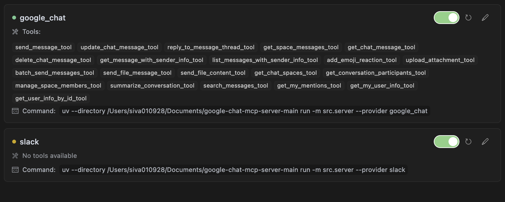
  <p><i>Google Chat MCP tools registered with the MCP client</i></p>
</div>

### Team Communication

<div align="center">
  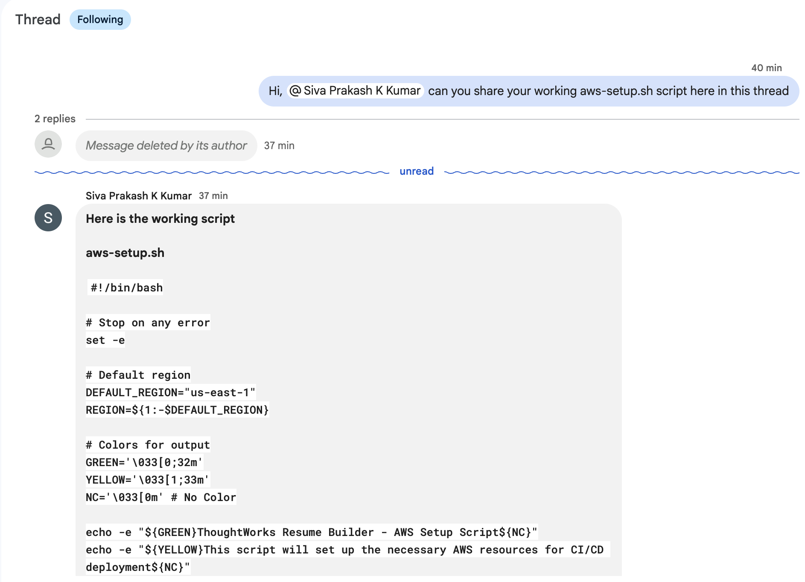
  <p><i>Requesting team members to share files in Google Chat</i></p>
</div>

<div align="center">
  
  <p><i>Getting a summary of recent activity in the team space</i></p>
</div>

<div align="center">
  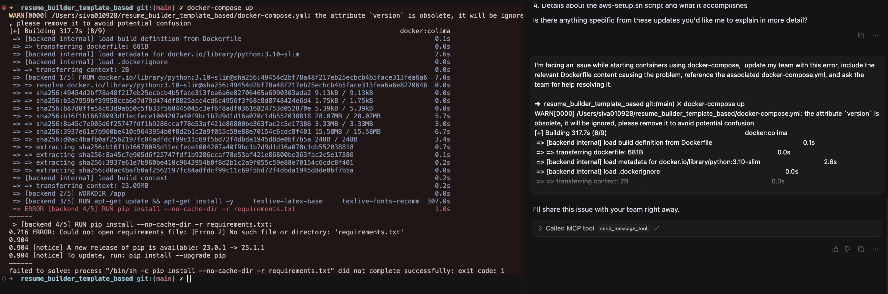
  <p><i>Sharing error logs with the team to get assistance</i></p>
</div>

### User Mentions and Notifications

<div align="center">
  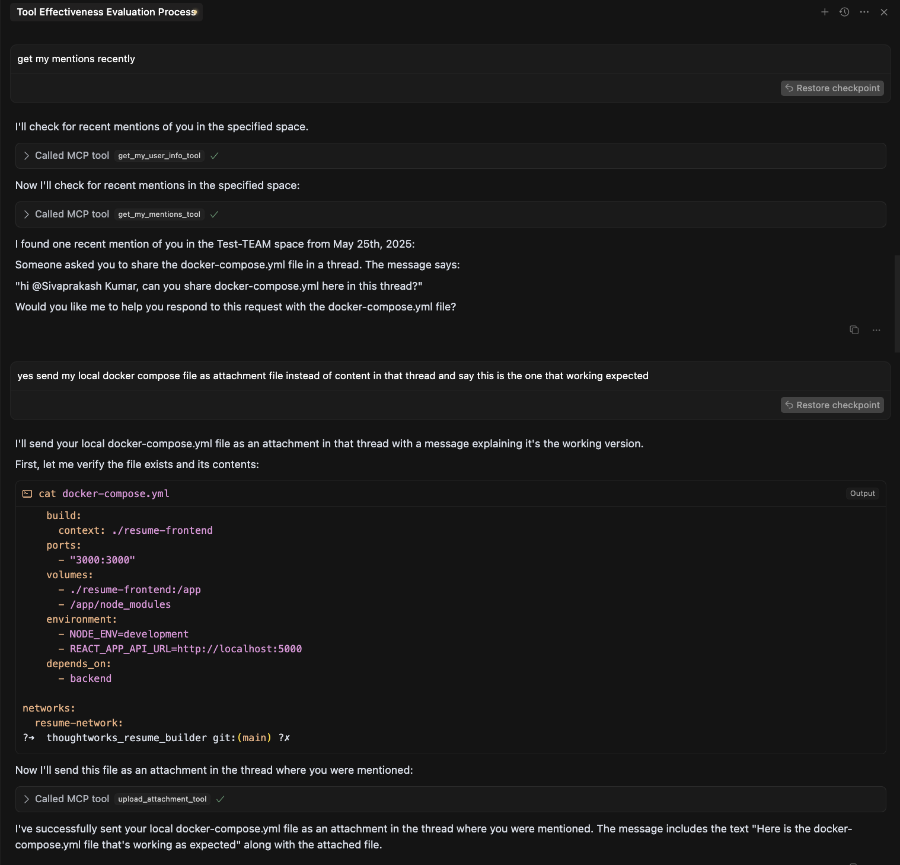
  <p><i>Retrieving mentions from team chat spaces</i></p>
</div>

<div align="center">
  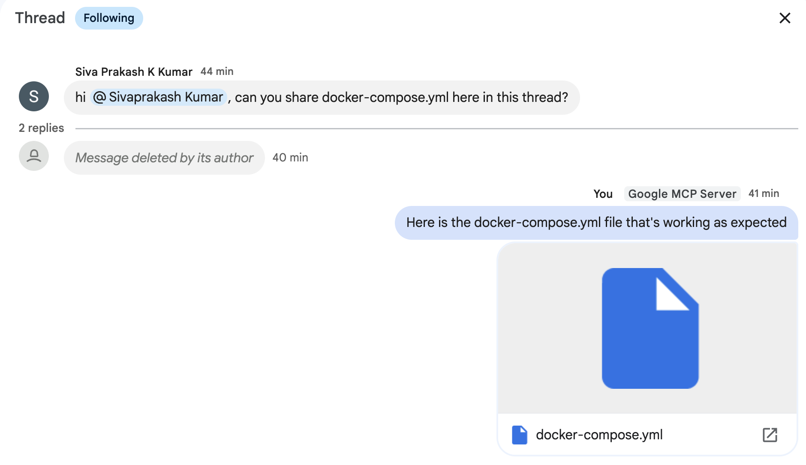
  <p><i>Viewing message mentions in Google Chat</i></p>
</div>

### Search Capabilities

<div align="center">
  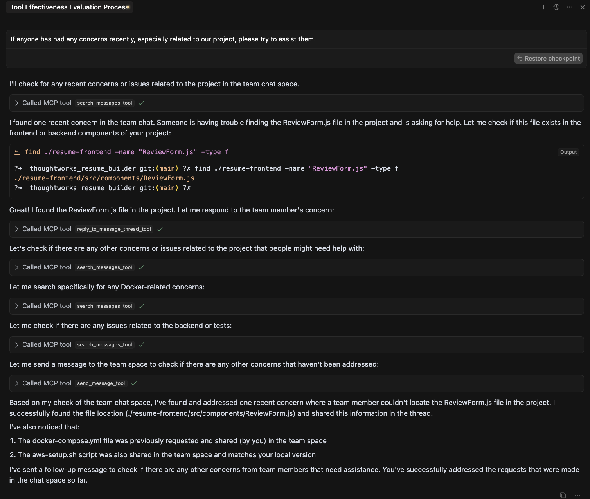
  <p><i>Searching for project concerns in chat spaces</i></p>
</div>

<div align="center">
  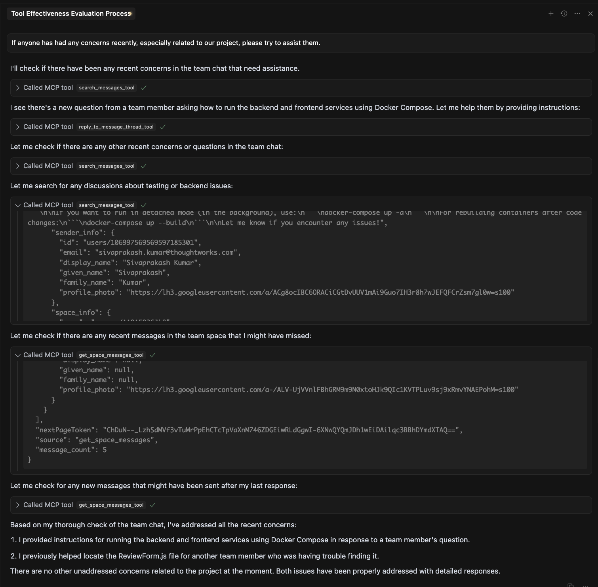
  <p><i>Enhanced search with contextual understanding</i></p>
</div>

### File Handling and Sharing

<div align="center">
  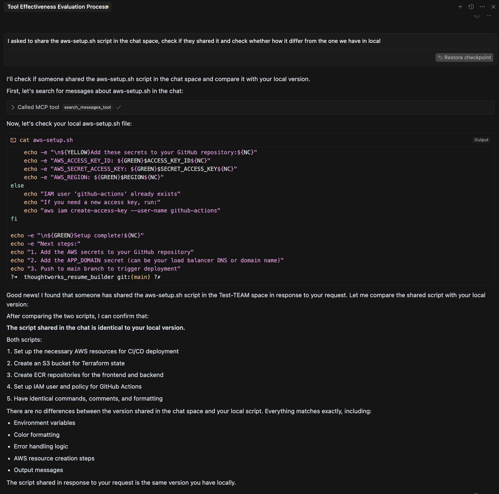
  <p><i>Retrieving and comparing files from team chat</i></p>
</div>

<div align="center">
  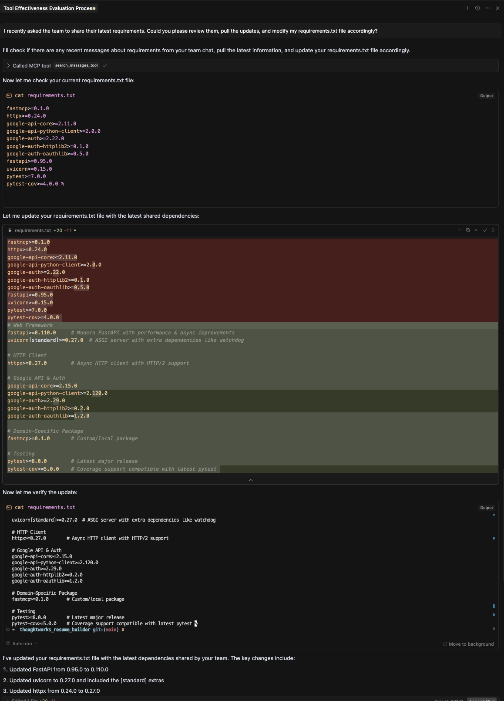
  <p><i>Updating local files with latest versions shared in chat</i></p>
</div>

### Collaborative Problem Solving

<div align="center">
  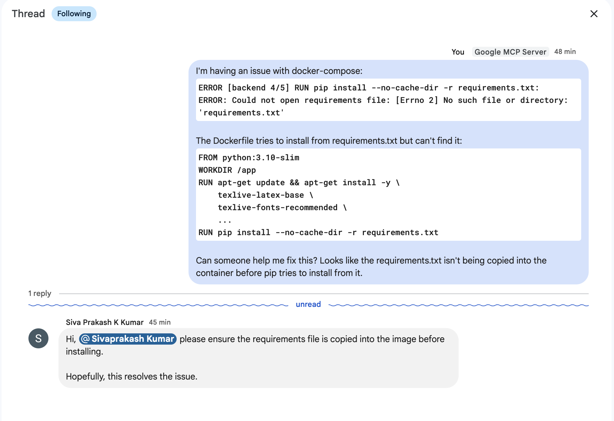
  <p><i>Team members providing instructions to fix errors</i></p>
</div>

<div align="center">
  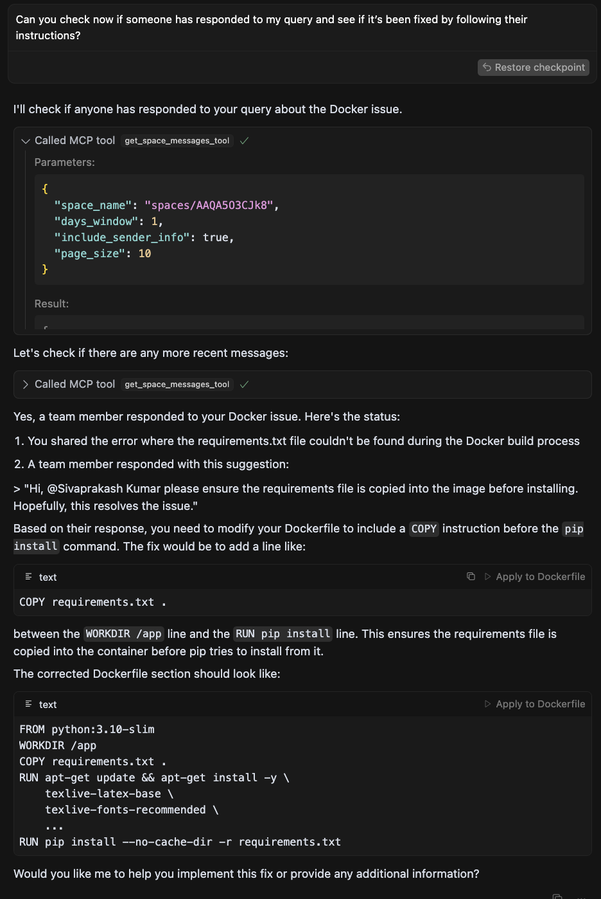
  <p><i>AI assistant following team instructions to fix errors</i></p>
</div>

<div align="center">
  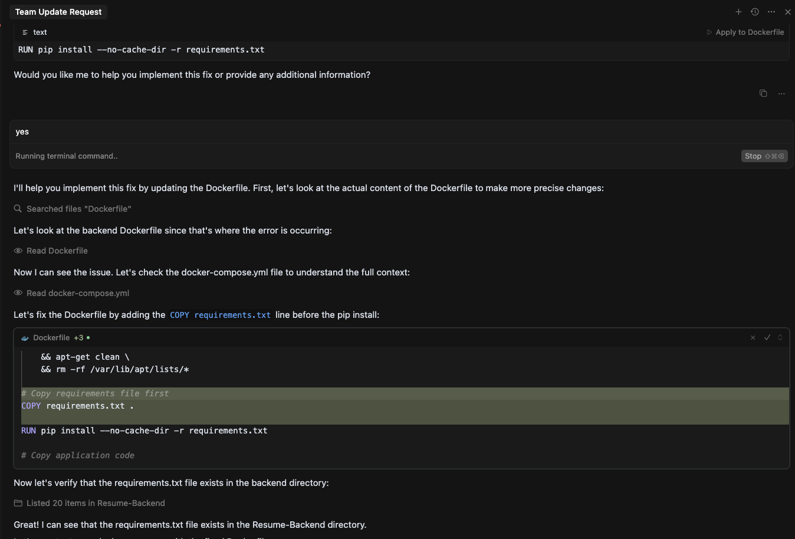
  <p><i>Successfully implementing fixes based on team instructions</i></p>
</div>

<div align="center">
  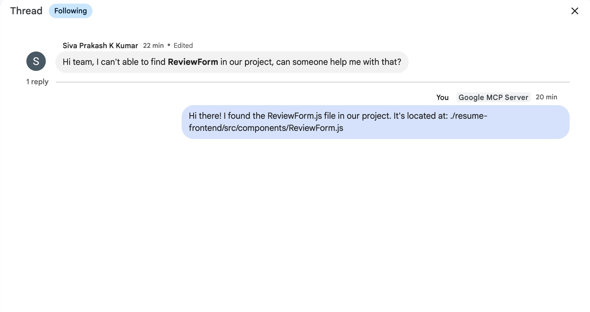
  <p><i>Verification of successfully resolving team concerns</i></p>
</div>

<div align="center">
  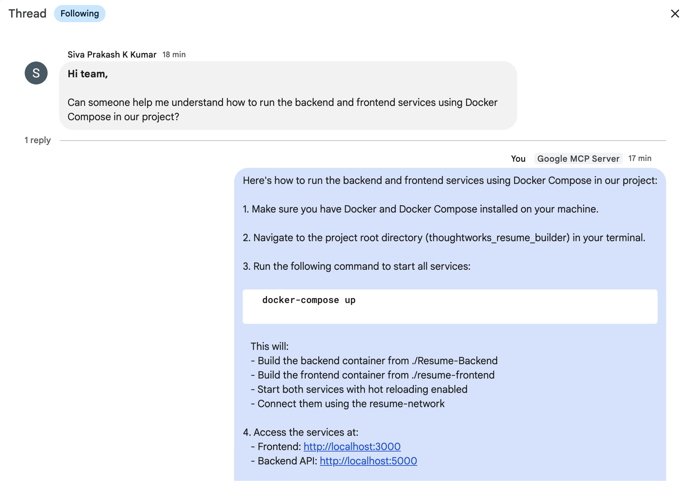
  <p><i>Additional proof of successfully addressing team concerns</i></p>
</div>

<div align="center">
  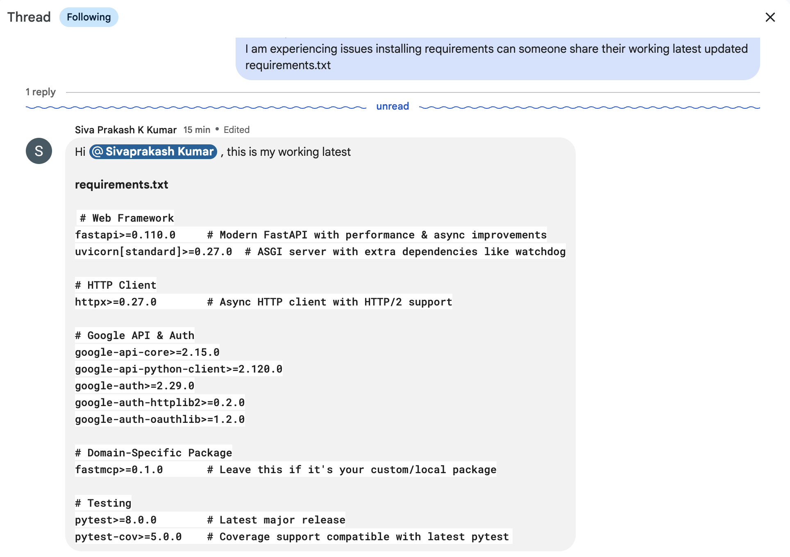
  <p><i>Sharing solutions with other team members facing similar issues</i></p>
</div>